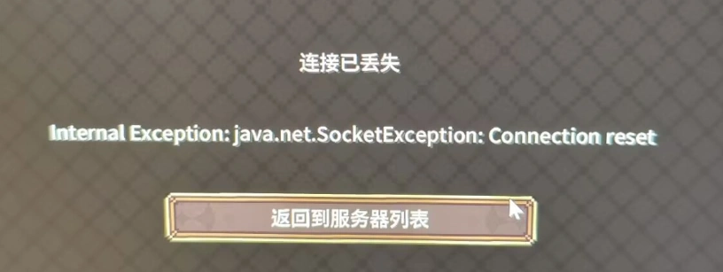

# 快速问答/重复问答内容手册

## How To Ask

根据原文协议 CC-BY-NC-SA 4.0 摘抄部分内容以供回答时使用：  
原文&原作：<https://lug.ustc.edu.cn/wiki/doc/howtoask/>

请先尝试自己解决问题：有的时候解决方法比想像的要简单得多（并且自己解决也比问别人快得多）。  
很多时候遇到的问题会伴随着错误信息，至少分一点点耐心去读一下错误信息可能对解决问题很有帮助。如果有能力的话，尝试从日志等地方收集相关的信息也很可能会有帮助。

### 避免 X-Y 型问题

X-Y 型问题指代这样一种情况：你遇到了 X 问题，你相信用 Y 方法可以解决 X 问题，但是不知道怎么使用，因此向别人提问如何使用 Y 的问题，而不告诉其他人 X 问题的内容。如果用 Y 方法解决 X 问题的思路是错误的，那么这样的提问就是浪费时间。

### 避免「在吗」/「有人吗」

在群聊的场景下，直接问问题比问「有人吗」是更好的选择——毕竟其他人有充分的理由不理你。例如：  
A (8:00): 在吗？  
B (13:00): 怎么了？  
A (15:00): 我遇到了 XXXXXXX 错误，然后 YYYY 命令跑不了，怎么办？  
B (16:00): 你应该 ZZZZZZZ

对比之下，直接提问：  
A (8:00): Hi，我遇到了 XXXXXXX 错误，然后 YYYY 命令跑不了，怎么办？  
B (13:00): 这样，你应该 ZZZZZZZ  
节省了大量无效交流时间。

### 避免「有没有人懂」

例如：有没有人懂 C++？有个问题想问问  
原因如下：  
    C++ 是非常复杂的，没有多少人真的懂/精通 C++。对很多别的领域也是类似的。  
    就算真的有人懂，懂的人很可能也不想在群里（通过回答这样的问题）夸耀自己很懂。而不太懂的人就更没有兴趣看你的问题了。  
    很多时候对应的问题即使是不精通相关领域的人也可以回答，对应的问题可能是某种常识。

没有人回答问题 ≠ 被无视，在群聊中，如果认真提问却没有人回答，更有可能发生的事情是：看到问题的人完全不知道如何解决，仅此而已。同时也需要注意，群聊中（或者论坛中）的其他与你素不相识的人也没有必须回答问题的义务。

## How To Ask Questions The Smart Way

Copyright © 2001,2006,2014 Eric S. Raymond, Rick Moen  
Copyleft 2001 by D.H.Grand(nOBODY/Ginux), 2010 by Gasolin, 2015 by Ryan Wu  
<https://lug.ustc.edu.cn/wiki/doc/smart-questions/>  
摘抄部分内容以减少攻击性和适配。注：可能违反原文分发协议，但这没办法

准备好你的问题，再将问题仔细的思考过一遍，因为草率的发问只能得到草率的回答，或者根本得不到任何答案。越是能表现出在寻求帮助前你为解决问题所付出的努力，你越有可能得到实质性的帮助。

别像机关枪似的一次“扫射”所有的帮助渠道，这就像大喊大叫一样会使人不快。要一个一个地来。

别用喋喋不休的帮帮忙、跪求、急（更别说救命啊！！！！这样让人反感的话，用这种标题会被条件反射式地忽略）来浪费这个机会。不要妄想用你的痛苦程度来打动我们，而应该是在这点空间中使用极简单扼要的描述方式来提出问题。

有一个古老而神圣的传统：如果你收到RTFM（Read The Fucking Manual）的回应，回答者认为你应该去读他妈的手册。当然，基本上他是对的，你应该去读一读。

RTFM 有一个年轻的亲戚。如果你收到STFW（Search The Fucking Web）的回应，回答者认为你应该到他妈的网上搜索。那人多半也是对的，去搜索一下吧。（更温和一点的说法是 Google 是你的朋友！）

通常，用这两句之一回答你的人会给你一份包含你需要内容的手册或者一个网址，而且他们打这些字的时候也正在读着。这些答复意味着回答者认为

    你需要的信息非常容易获得；
    你自己去搜索这些信息比灌给你，能让你学到更多。

## 如何有效地报告 Bug （节选）

“精确的描述您看到了什么。告诉他们为什么您觉得自己所看到的是错误的，最好再告诉他们，您认为自己应该看到什么。如果您只是说：“程序出错了”，那您很可能漏掉了非常重要的信息。”  
“只报告“程序出了一个错”是毫无意义的，除非您把错误消息一块报上来。”  
Copyright © Simon Tatham 1999  
<https://www.chiark.greenend.org.uk/~sgtatham/bugs-cn.html>  
licensed under OPL v1

## 问答存档库

快速索引/搜索页：[RefenceSearch.html](/RefenceSearch.html)

### N.001

索引：隧道创建、网络高峰期、节点消失  
last update: 2025/12/12

Pursuit.: 12-10 15:31:45  
大佬们，我这几天在跟朋友一起玩我的世界，但是每天晚上开映射的时候只有几个内地隧道，这是怎么回事呀

Java8ver64: 12-10 16:35:55  
你说的 “隧道” 应该指的是节点  
你建好觉得好用的隧道不要删掉，不要随便看不知道哪的教程然后每天都新建隧道，隧道是重复使用的，而不是一次性物品

TIPS：在负载高的时候樱花会暂停新建隧道，但不影响建好的隧道。

### N.002

索引：流量消耗、Minecraft  
last update: 2025/12/10

渲染距离、模拟距离、玩家数、在线时间、模组（数量、用法、地形、代码质量）、插件、服务器玩法（机器、地形、预载）、玩家玩法（刷图、机器、背包）等都会影响游戏需要传输的数据大小

你可以尝试使用 <https://www.curseforge.com/minecraft/mc-mods/connectivity>  
进行排查，命令如下:  
/connectivity packetsAllPlayers  
列出网络使用情况最高的玩家  
/connectivity packetsSummary  
按包类型列出服务器上数量、速率占用最高的包  
/connectivity packetsPlayer 【玩家名】  
按包类型列出该玩家数量、速率占用最高的包

但很可能得到的结果是一个大类(例如玩家NBT数据)或者重要玩法模组，这种近乎无解 只能建议换包玩()

### N.003

索引：安全建议、通用  
last update: 2025/12/10

如果你使用映射软件，应当考虑到随时有不知道哪来的人正在高强度扫描节点的端口  
任何映射到公网的端口都应当视为不安全 在无鉴权的情况下暴露可操作的端口(例如smb/rdp/ssh/内部服务器专用端口/网络操作界面)是非常危险的  
只是映射游戏也要考虑备份存档，群内出过端口被扫描然后被熊的事件。

### N.004

索引：Minecraft、日志、DEBUG  
last update: 2025/12/10

游戏日志:  
无版本隔离：\.minecraft\logs\latest.log  
开版本隔离：\.minecraft\versions\版本名\logs\latest.log  

上传文件到群文件。

如何在不能发送文件的群中发送日志: 打开文件，确认不是乱码后全选复制

把内容黏贴到 <https://paste.fastmirror.net/>  
点送出，把给的链接发群里

### N.005

索引：Minecraft、服务器列表、服务器信息、红叉  
last update: 2025/12/12

我想不出来: 12-10 21:44:19  
这是怎么回事呀（注：指服务器列表旁的红x）

Java8ver64: 12-10 21:44:54  
点进去看报错 这个x没有用

Java8ver64: 12-10 21:45:20  
如果你能进服务器但是觉得这个x不顺眼可以装这个模组 <https://www.mcmod.cn/class/6048.html>

我想不出来: 12-10 21:45:29  
好的好的

我想不出来: 12-10 21:45:59  
我和朋友用的是同一个安装包

Java8ver64: 12-10 21:46:01  
fml自己通过ping判断频道的方法有问题

Java8ver64: 12-10 21:46:15  
所以你要进去看报错 没报错就说明是它这个x显示错了

Java8ver64: 12-10 21:46:19  
有报错看报错再说（注：指先尝试进入服务器，如果遇到问题，请截图错误界面发到群里）

Java8ver64: 12-10 21:46:23  
这个x没有任何有用信息

### N.006

索引：Minecraft、无法加入、refused、reset  
last update: 2025/12/12

如果您在尝试加入游戏的时候遇到以上报错，请按顺序排查：  

1. sakura 的日志中是否有错误？如有，请先按文档地址排查相关问题

    例如：[请检查本地服务是否可访问](https://doc.natfrp.com/app/mc.html#connect-to-local-service-error)

2. 无法访问的用户是否可访问节点域名？

    部分校园网和公司网络会阻断对隧道的访问，可以尝试更换网络（例如断开手机 WLAN 后使用流量+热点）后再试

3. 是否是房主/服务器端主动拒绝了连接？

    请检查游戏日志。如果不会或者没有相关知识，请参考 [#N.004](#n004) 后在相关群内询问。

### N.007

索引：

### N.008

索引：

### N.009

索引：
