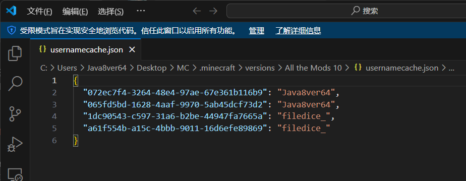

# 存档丢失补救方法

如果因正版验证模式切换导致存档丢失，可以尝试以下手动恢复方法。**在进行任何操作前，请备份 saves 文件夹，以防操作失误导致数据永久丢失。**

1. 首先，前往游戏版本对应的根目录（如果启用了版本隔离，路径为 `.minecraft\versions\<版本名>\` ），找到并使用文本编辑器打开 usernamecache.json 文件。

2. 在这个文件中，您会看到一个或多个玩家名及其对应的UUID列表。当存档丢失问题发生时，通常会发现同一个玩家名对应着两个不同的UUID，一个是正版验证时使用的在线UUID，另一个是离线UUID。
   

3. 接下来，定位到具体的玩家数据文件。路径为：`.minecraft\versions\<版本名>\saves\<世界名>\playerdata\` 。此文件夹内存放着以UUID命名的 .dat 文件，每个文件都对应一份玩家的存档数据。

4. 对照 usernamecache.json 文件中的信息，在 playerdata 文件夹里找到属于该玩家的两个 .dat 文件。您可以通过“修改日期”来区分它们：较早创建的文件是包含您进度的旧存档，而最近创建的则是游戏生成的新存档（空存档）。
   

5. 要恢复数据，请执行以下步骤：

- 备份你的存档。（包括这个玩家数据文件夹）
- 删除新生成的 .dat 文件。
- 将旧的 .dat 文件重命名，使其文件名与刚刚删除的新文件完全一致（即，将旧存档的UUID改成新存档的UUID）。
